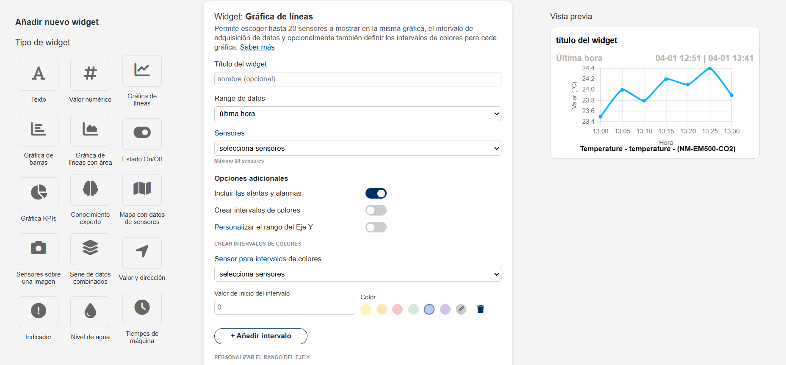

# 📊 Dashboard de Widgets

## 📌 Descripción
Este proyecto es una prueba técnica en la que se ha desarrollado un **dashboard de widgets interactivo**. La interfaz permite seleccionar distintos tipos de widgets, configurar opciones adicionales y visualizar una **gráfica en tiempo real**.  

## 🎯 **Objetivos cumplidos**
✅ **Estructura HTML, CSS y JavaScript organizada** en archivos separados.  
✅ **Dinamismo en la selección de widgets** en la columna izquierda.  
✅ **Acciones interactivas en el menú central** (switches, selectores, checkboxes).  
✅ **Diseño responsivo**, adaptado a dispositivos móviles y desktop.  
✅ **Gráfica dinámica** con `Chart.js`, mostrando datos en tiempo real.  

---

## 📂 **Estructura del proyecto**

---

## 🛠️ **Tecnologías utilizadas**
- **HTML5** → Para la estructura de la interfaz.  
- **CSS3** → Para el diseño y la adaptación responsiva.  
- **JavaScript (Vanilla JS)** → Para la interactividad y el dinamismo.  
- **Chart.js** → Para la visualización de datos en la gráfica.  
- **FontAwesome** → Para los iconos de los widgets.  

---

## 🚀 **Características principales**
### **1. Selección dinámica de widgets**
- Solo el widget seleccionado en la **columna izquierda** se destaca.
- Se aplica una **clase activa** al hacer clic en un widget.

### **2. Configuración interactiva del menú central**
- **Inputs dinámicos**: Cambios en los campos de texto se reflejan en la vista previa.
- **Checkboxes y switches funcionales**:
  - `Incluir las alertas y alarmas`
  - `Crear intervalos de colores`
  - `Personalizar el rango del Eje Y`
- **Botón de "Añadir intervalo"**: Agrega nuevos intervalos de color dinámicamente.

### **3. Gráfica interactiva en la vista previa**
- Se usa `Chart.js` para renderizar una **gráfica de líneas dinámica**.
- **Los datos se actualizan automáticamente** en la vista previa.

### **4. Diseño responsivo**
- **Uso de Flexbox y Media Queries** para adaptar la interfaz a **dispositivos móviles**.
- **Distribución de columnas ajustable** según el tamaño de pantalla.

## 📸 **Captura de pantalla del resultado final**

---

## 📜 **Instrucciones de uso**
1️⃣ Clona el repositorio o descarga los archivos:  
https://github.com/karensalazar3/Pruebatecnica

---

KAREN SALAZAR.
